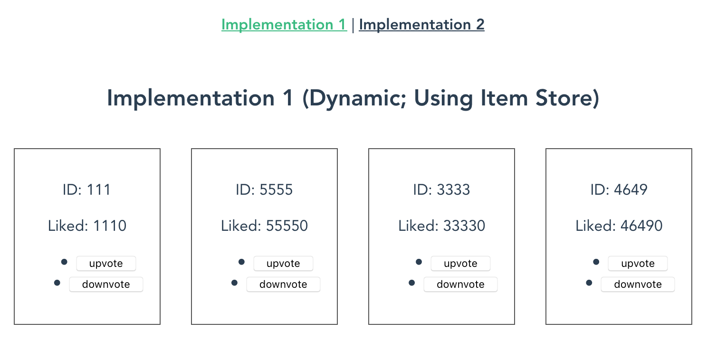

# vuex-dynamic-module-impl

A Test Implementation for Vuex Dynamic Module.

See it in action: [https://mangano-ito.github.io/vuex-dynamic-module-impl/](https://mangano-ito.github.io/vuex-dynamic-module-impl/)



Dynamic Module enables you to focus on each item of list by providing items with individual `Store`s, so that you don't need to have a big `Map<K, V>`-like object in a single list `Store` nor find the item of interest by ID on every single `Mutation`.

For example, let's have a static list `Store` like this (pseudo code):

```typescript
// list_store.ts

// You have State of the whole list.
const state = {
    items: {
        'my-item-1': {
            id: 'my-item-1',
            likes: 100,
        },
        'my-item-999': {
            id: 'my-item-999',
            likes: 999,
        },
    }
};

const mutations = {
    incrementLike(state, payload) {
        // first, find the item of interest...
        const { id } = payload;
        const item = state[id];
        if (item) {
            // then, upvote it.
            ++item.like;
        }
    }
};
```

By having Dynamic Module, you can refactor it into an item `Store`, then you have:

```typescript
// item_store.ts

// You have a single item State now.
const state = {
    id: 'my-item-1',
    likes: 100,
};

const mutations = {
    incrementLike(state) {
        // You don't need to find the item of interest by ID!
        // you've got its State.
        ++state.likes;
    }
};
```

Find 2 `Store` implementation differences in `src/stores/{item, list}`, `src/views/` and `src/components`.

## Project setup
```
yarn install
```

### Compiles and hot-reloads for development
```
yarn run serve
```

### Compiles and minifies for production
```
yarn run build
```

### Run your tests
```
yarn run test
```

### Lints and fixes files
```
yarn run lint
```

### Run your unit tests
```
yarn run test:unit
```

### Customize configuration
See [Configuration Reference](https://cli.vuejs.org/config/).
